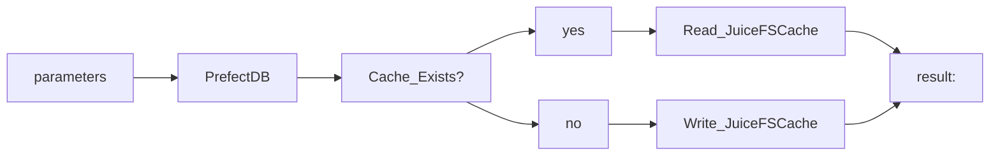

# Prefect + Orion + JuiceFS POC

## Overview
The idea of this repo is to illustrate how prefect caching can be leveraged using JuiceFS in both a cloud and local environment. 

The basic idea of this pairing is that [Prefect](https://docs.prefect.io/) has been designed to natively handle flow run caching using local filesystems. There exists to my knowledge no distributed or cloud native means to leverage this caching mechanism other than using mounted S3 volumes.

Although a simple S3 mounted storage would work, it would not be fit for the purpose of minimising latency, maximising throughput and simplifying developer experience. 

[JuiceFS](https://juicefs.com/docs/community/introduction) is purpose built high-performance distributed file system. Superficially the difference in throughput can be illustrated by:


# Usage
To run this repo perform the following steps:
1. Install [JuiceFS](https://juicefs.com/docs/community/installation/) on your local machine 

    |  Note that MacOS users need to also install MacFUSE via brew

1. Setup python virtual environment
1. Install python dependencies

    `pip install -r requirements.txt`
1. Startup JuiceFS
```
./start_juice.sh
```
1. In virtualenv run:
```
source .env && python main -input 1 2 3
```

The prefect script accepts space seperated inputs that are cast to a list. 
These input are used to generate a hash key. The function is artificially halted for three seconds when run for the first time. After that a cache should be used. 

Notably JuiceFS is not needed for this example to run, in fact everything should run perfectly well without JuiceFS, as expected. The big benefit here is that in theory the mounted files system should perform exactly like a local path, regardless of where the scipt gets executed. 

The caveat here is that a substantial amount of opionated configuration for both Prefect and JuiceFS is being handled in the `.env` file. This can be gradually modified to hosted or local configurations based on the runtime requirements.
 
## Architecture


Expanding on flow contents we see:


Importantly, by using JuiceFS, the filesystem can be abstacted to either a local directory or a shared S3 bakcend directory based on the runtime

## Prefect Orion
To monitor and review prefect runs locally, the following script can be executed:

```
 source .env && python main 
```


